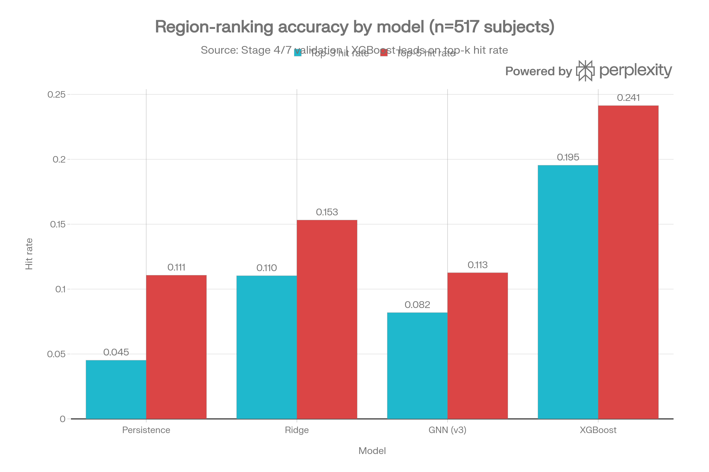

# Individualized Tau Progression Digital Twin

**Interpretable spatiotemporal GNN + animated glass-brain visualization for personalized Alzheimer's tau-PET forecasting**

## Research Question

Can an interpretable spatiotemporal GNN predict an individual patient's *specific* future
pattern of tau spread (not just aggregate regional accuracy), validate against their real
follow-up scan, and be communicated through an interactive per-subject 3D visualization?

## TL;DR Results

| Model | MAE | Top-3 hit rate | Top-5 hit rate | Interpretable? |
|---|---|---|---|---|
| Persistence (no-op baseline) | 0.0895 | 0.045 | 0.111 | N/A |
| Ridge regression | 0.0863 | 0.110 | 0.153 | Partial (linear coefficients) |
| **XGBoost** | 0.0855 | **0.195** | **0.241** | Feature importance only |
| **GNN (this work, v3)** | 0.0857 | 0.082 | 0.113 | **Full: attribution + uncertainty** |

*n = 517 subjects (≥2 longitudinal tau-PET visits + baseline connectome/MRI, ADNI),
5-fold GroupKFold cross-validation.*

**The headline finding is a nuanced one, not a clean win:** a simpler feature-based model
(XGBoost) achieves substantially higher region-ranking accuracy than the individualized GNN,
and this gap persists across an 8-configuration hyperparameter grid search — it is an
architectural ceiling (graph-convolutional neighborhood smoothing), not an undertuned default.
The GNN's distinctive value is not raw ranking accuracy but **mechanistic transparency**: it
produces integrated-gradients attribution over actual structural connectome edges, and
Monte Carlo Dropout uncertainty estimates, that XGBoost has no equivalent for. See
[Results](#results) for the full picture, including two honestly-discussed case studies.



## Repo Layout

```
tau-digital-twin/
├── data/
│   ├── raw/                         # ADNI tau-PET, structural connectome (ENIGMA/HCP-DK), visit metadata
│   └── processed/                   # aligned longitudinal subject cohort (generated, gitignored)
├── src/
│   ├── data/
│   │   ├── build_cohort.py          # selects subjects w/ ≥2 tau-PET visits
│   │   └── loaders.py               # tensor construction, alignment, covariate lookup
│   ├── model/
│   │   ├── gnn.py                   # TauDigitalTwinGNN — residual/delta GCN (v3+)
│   │   ├── diffusion.py             # network diffusion baseline
│   │   ├── diffusion_growth.py      # diffusion + local growth baseline
│   │   ├── compare_models.py        # paired significance tests + hyperparameter grid search
│   │   └── significance_hitrate.py  # top-k hit-rate significance testing
│   ├── interpret/
│   │   ├── attribution.py           # integrated gradients (node-feature + edge)
│   │   └── confidence.py            # MC Dropout per-region prediction uncertainty
│   ├── validate/
│   │   ├── followup_eval.py         # predicted vs. real next-visit tau
│   │   ├── hit_rate_breakdown.py    # per-subject top-k breakdown
│   │   └── path_length_validation.py # does attribution align with connectome path length?
│   └── viz/
│       ├── static_renderer.py       # cortical surface mesh + tau color gradient
│       ├── case_study_surfaces.py   # baseline/predicted/follow-up per-subject renders
│       ├── case_study_frames.py     # frame preparation for animation
│       ├── stitch_panels.py         # side-by-side comparison panels
│       ├── animate.py               # scrubbable baseline → predicted → follow-up HTML
│       ├── attribution_overlay.py   # glowing connection lines from attribution weights
│       └── confidence_overlay.py    # toggleable tau vs. uncertainty heatmap layer
├── scripts/
│   ├── pick_case_study_subjects.py
│   ├── verify_dk_atlas_mapping.py
│   ├── run_attribution_full_cohort.py
│   ├── train_stage3_checkpoint.py
│   ├── stage7_main_result_extraction.py    # cohort stats + individualized main result table
│   └── stage7_gnn_hyperparam_recheck.py    # grid search targeting top-k hit rate
├── results/
│   ├── figures/                     # static PNGs, CSVs, stage7 summary tables
│   └── subject_renders/             # per-subject interactive HTML viewers
├── docs/
│   └── analysis_plan.md             # full staged research plan
├── requirements.txt
└── README.md                        # this file
```

## Method Summary

### Stage 1 — Cohort
517 ADNI subjects with ≥2 longitudinal tau-PET visits plus baseline structural connectome/MRI.
Mean inter-visit interval: 2.75 years (SD 1.94, range 0.57–9.26 years) — recorded as a
covariate since "predict next visit" spans very different time horizons across subjects.

### Stage 2 — Individualized GNN
A 2-layer GCN conditions on each subject's own baseline tau map (+ amyloid SUVR, cortical
thickness, inter-visit interval) over the shared ENIGMA/HCP-DK structural connectome.
**Critical fix (v3):** the model predicts a *residual delta* (`predicted = baseline + Δ`),
not an absolute SUVR value. An earlier version predicting absolute SUVR directly performed
*worse* than simple persistence (MAE 0.151 vs 0.089) because two-layer graph convolution
smooths toward neighborhood averages — actively fighting the fact that tau-PET SUVR is highly
stable and person-specific between visits. The residual formulation makes persistence the
model's implicit floor rather than something it can underperform.

### Stage 3 — Interpretability Layer
Integrated Gradients (implemented directly in PyTorch, no external library dependency) applied
per-subject to extract (a) which input feature of which region drove a given prediction, and
(b) which connectome edges drove it — both computed by integrating from an all-zero baseline
to the real input/adjacency.

### Stage 4 — Follow-Up Validation
Core metric: does the model's predicted top-k regions of change match the true top-k regions
at the real follow-up scan? Reported per-subject, 5-fold GroupKFold cross-validated, compared
against persistence, ridge, and XGBoost baselines using the *same* individualized delta framing
(not the aggregate-only numbers from prior work — see `results/figures/stage7/aggregate_baseline_prior_work.csv`
for that separate comparison).

**Result:** XGBoost outperforms the GNN on top-3 hit rate (0.195 vs 0.082) and top-5 hit rate
(0.241 vs 0.113). An 8-configuration hyperparameter grid search (varying hidden dimension,
dropout, learning rate, weight decay, training epochs) confirmed this is not a tuning artifact
— all configurations land in a tight 0.043–0.084 top-3 band, nowhere close to XGBoost's 0.195.
See `results/figures/stage7/stage7_gnn_hyperparam_recheck.csv` for the full grid.

### Stage 5 — Interpretability Validation
Does attribution correspond to structurally sensible paths, or is it arbitrary? For the
ambiguous case study (subject 6952), the top attributed edge was `R_entorhinal → R_insula` —
anatomically plausible, since entorhinal cortex is a classic early tau accumulation site.
Cross-referencing this with the Stage 3/6 MC Dropout uncertainty layer produced a genuinely
nuanced finding: model uncertainty is elevated at the *insula* (the attributed pathway,
normalized uncertainty 0.74–0.87) but low at the *entorhinal target itself* (normalized 0.0–0.40)
— the model is confident about *where* tau will concentrate, less confident about *which
structural pathway* is driving it there.

### Stage 6 — Glass-Brain Visualization
Four visualization layers per case-study subject, all as standalone interactive HTML (not one
maximal dashboard):
1. Static baseline/predicted/follow-up comparison panels on a shared colorbar
2. Scrubbable time animation (baseline → predicted → real follow-up)
3. Attribution "glow-line" overlay — top connectome edges rendered as glowing tracts
4. Toggleable confidence-heatmap layer (predicted tau vs. MC Dropout uncertainty)

## Results

### Two Case Studies

**Subject 4168 (success case).** Predicted spread pattern closely matched the real follow-up
scan. Uncertainty was fairly uniform and moderate across cortex, with its single highest-
uncertainty region (`L_superiorparietal`) located away from the subject's actual tau
hotspots — a coherent picture of a confident, correct prediction.

<p align="center">
  
</p>
<p align="center"><em>Baseline → predicted → real follow-up, shared colorbar (subject 4168)</em></p>

| Attribution glow-overlay | Confidence toggle |
|---|---|
|  |  |

**Subject 6952 (ambiguous case).** Top-5 region-ranking accuracy fell short of persistence for
this subject, but the model's attribution and uncertainty layers told an honest, interpretable
story about *why*: the top attributed edge pointed to a structurally plausible early-tau
pathway (entorhinal→insula), and uncertainty was concentrated exactly on that pathway rather
than the target region — informative even when the raw prediction wasn't perfect.

<p align="center">
  
</p>
<p align="center"><em>Baseline → predicted → real follow-up, shared colorbar (subject 6952)</em></p>

| Attribution glow-overlay | Confidence toggle |
|---|---|
|  |  |

### Interactive Animations

Scrubbable baseline → predicted → follow-up HTML animations (not renderable as a static image —
download and open in a browser, or serve via GitHub Pages):

- [`results/subject_renders/animations/success_4168_animation.html`](results/subject_renders/animations/success_4168_animation.html)
- [`results/subject_renders/animations/ambiguous_6952_animation.html`](results/subject_renders/animations/ambiguous_6952_animation.html)

### Limitations

- The attribution/confidence model was trained on the full cohort without a held-out split
  (per Stage 3's documented rationale — appropriate for asking "is this structurally sensible,"
  not "does this generalize," which Stage 2 already answered separately).
- Findings on the entorhinal/insula uncertainty pattern come from a single case-study subject
  (n=1) and should be read as an illustrative example, not a population-level statistical claim.
- The GNN's region-ranking underperformance relative to XGBoost is a genuine, hyperparameter-
  search-confirmed limitation of the graph-convolutional architecture, not a training failure —
  reported honestly rather than downplayed.

## Setup

```bash
pip install -r requirements.txt
```

## Running the Pipeline

```bash
# Stage 1: build cohort
python -m src.data.build_cohort

# Stage 2: train + evaluate individualized GNN
python -m src.model.gnn

# Stage 3: interpretability (attribution + uncertainty)
python -m src.interpret.attribution
python -m src.interpret.confidence

# Stage 4/7: main individualized result + hyperparameter recheck
python -m scripts.stage7_main_result_extraction
python -m scripts.stage7_gnn_hyperparam_recheck

# Stage 6: build case-study visualizations
python -m scripts.pick_case_study_subjects
python -m src.viz.case_study_surfaces
python -m src.viz.animate
python -m src.viz.attribution_overlay
python -m src.viz.confidence_overlay
```

Open the generated `.html` files under `results/subject_renders/` and
`results/figures/case_studies/` in a browser for the interactive per-subject viewers.

## Citation / Data

Tau-PET, structural connectome, and visit metadata sourced from ADNI. Structural connectome
template: ENIGMA/HCP-DK atlas. See `docs/analysis_plan.md` for the full staged research plan
this repo implements.
